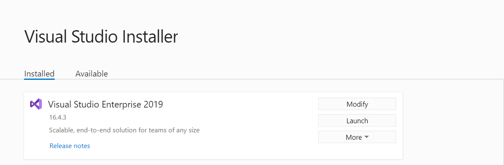
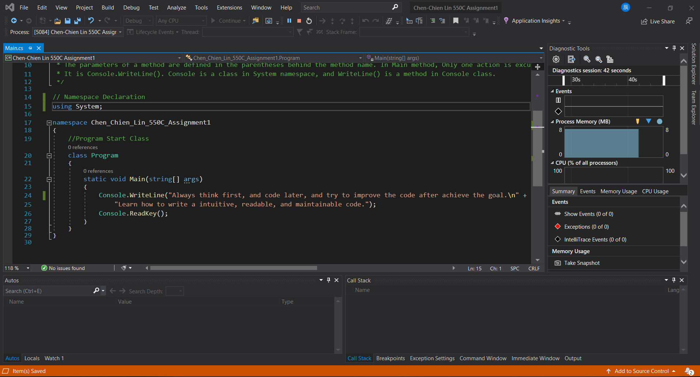
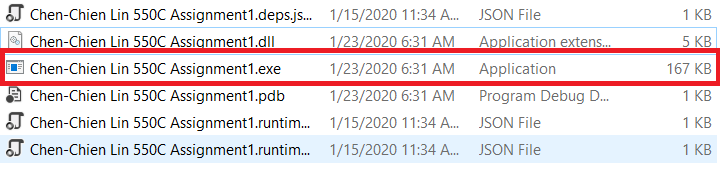
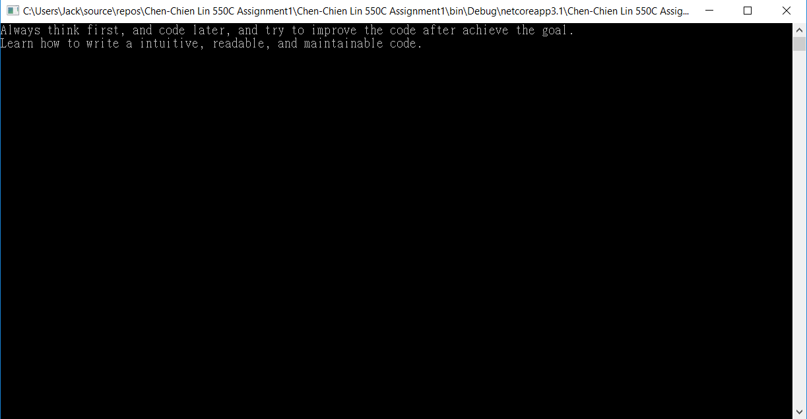

# Chen-Chien-Lin-MECH 550C-Assignment 1

This project is for MECH 550C

## Getting Started

These instructions will get you a copy of the project up and running on your local machine for development and testing purposes. See deployment for notes on how to deploy the project on a live system.

### Prerequisites

To write C# code, you need Microsoft Visual Studio. Visual Studio comes in different editions:
Community, Professional and Ultimate.
As an individual, or a student or a small team, you can download Visual Studio Community Edition
for free and build your free or paid apps with it. To download Visual Studio Community Edition,
please visit:
https://www.visualstudio.com/en-us/products/visual-studio-community-vs.aspx

### Installing

Step1: Go to Visual Studio page, and download Visual Studio. Users can download different Editions depends on their needs. For students,
download Visual Studio Community.

Step2: After downloading, open Visual Studio Installer, and click to Wrokload. Users can install toolsets they need, and select installation location.

Step3: After installation, users can launch Visual Studio 2019 Community.

### Debugging tools in Visual Studio

After finish coding, users can run their code in the debug mode or run without debug mode. 

| Key           | Description           |
| ------------- |:---------------------:|
| F5            | Run in the debug mode |
| Ctrl + F5     | Run without debug     |
| F9            | Breakpoint            |
| F10           | Step Over             |
| F11           | Step Into             |

 

 

There is no data in this project, thus, no variables shows up in Autos.

## Running the tests

After compliation, an excutable is created. Double click the excutable to run the application.

The result of the application will show on the command prompt.

## Authors

* **Chen-Chien Lin**
